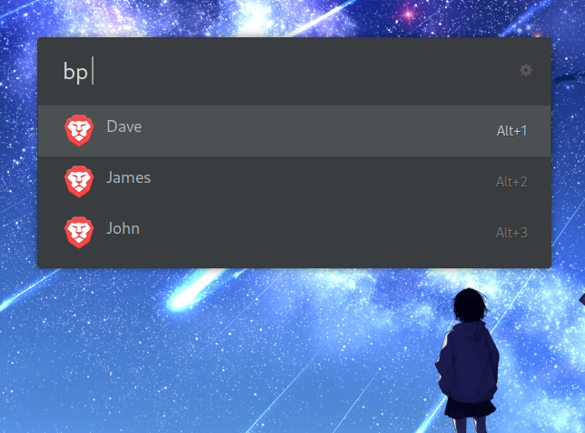

# ulauncher-brave-profiles

> [Ulauncher](https://ulauncher.io) extension for launching Brave Browser using a chosen user profile.

## Screenshot



## Requirements

- Ulauncher
- Python 3

## Install

Open ulauncher preferences window -> extensions -> add extension and paste the following url:

```
https://github.com/SinghRobinKumar/ulauncher-brave-profiles
```

## Contributing

- Fork it!
- Create your feature branch: git checkout -b feature/my-feature
- Commit your changes: git commit -am 'Add some feature'
- Push to the branch: git push origin my-new-feature
- Submit a pull request :D

## Authors

- [Robin Kumar Singh](https://github.com/SinghRobinKumar)
- README.md copied from [Alessandro Racheli](https://github.com/floydjohn)

## License

MIT &copy; [Robin Kumar Singh]
